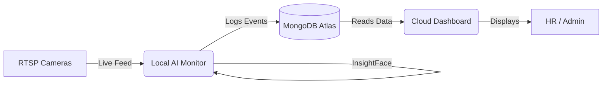

# Office Attendance System (Phase 3)

A high-performance, multi-camera employee attendance system built with Python, InsightFace, and MongoDB.

This project is architected to run in a **split deployment** mode:
1. **Local Camera Monitor**: A heavy AI processing engine that runs on a local PC connected to the office network cameras (operating automatically from 9 AM to 9 PM to save resources).
2. **Cloud Dashboard**: A lightweight, 24/7 Flask web application hosted on the cloud (e.g., Render) for HR and administrators to view live statistics and generate reports from anywhere.

## Key Features

* **Advanced Face Recognition**: Upgraded to **InsightFace (ArcFace 512-d)** for state-of-the-art accuracy, replacing the older MTCNN+Facenet pipeline.
* **Multi-Camera Processing**: Connect multiple RTSP/IP cameras to track entries and exits.
* **MongoDB Integration**: Completely migrated from SQLite to MongoDB to support distributed cloud deployment and high-speed logging.
* **Anti-Spoofing & Liveness Detection**: Prevents attendance fraud (e.g., holding up a photo) via a secondary AI liveness check.
* **Automated Email Alerts**: Sends SMTP email alerts to the admin when an unknown person is detected or if a camera goes offline.
* **Beautiful HR Dashboard**: A responsive, modern Flask web interface built without complex frontend frameworks (Vanilla HTML/CSS/JS). Features daily attendance summaries and Excel report exports.

## Architecture

## Deployment Instructions

### 1. Cloud Database (MongoDB Atlas)
Create a cluster on MongoDB Atlas and get your Connection String (URI).

### 2. Cloud Dashboard (Render)
Deploy this repository as a Web Service on Render or any cloud provider:
* **Build Command:** `pip install -r requirements.txt`
* **Start Command:** `gunicorn dashboard.app:app`
* **Environment Variable:** Add `MONGO_URI` and paste your MongoDB Connection String.

*(Note: The "Live Cameras" video feed tab is automatically hidden in cloud deployments because the cloud server cannot access your local office network).*

### 3. Local Camera Monitor
On the local PC connected to the cameras:
1. Install dependencies: `pip install -r requirements.txt`
2. Enroll employees by adding images to the `employee gallery/` folder and running `python enroll_employees.py`.
3. Launch the AI monitor connected to your cloud database by double-clicking:
   **`start_cloud.bat`** (It will prompt you for your `MONGO_URI`).

## Configuration
All thresholds, cooldowns, email credentials, and camera streams are easily configurable inside `config.py`.

* **`OFFICE_START_HOUR` / `OFFICE_END_HOUR`**: Restricts the AI processing window to office hours (default 9:00 to 21:00) to save GPU power.
* **`ATTENDANCE_CAMERA_URLS`**: List of RTSP streams for Entry/Exit cameras.
* **`COOLDOWN_MINUTES`**: Prevents spamming the database with rapid consecutive detections.
